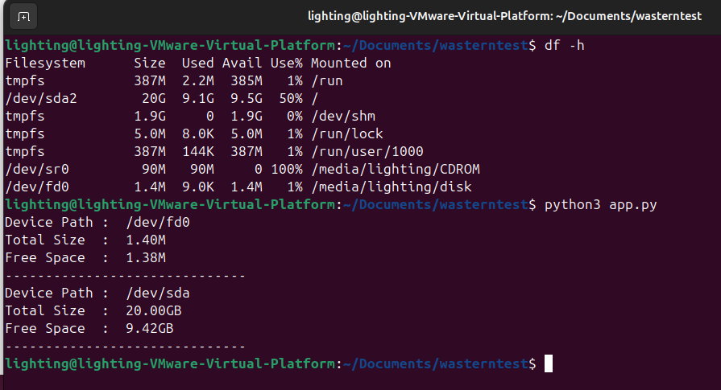

# WD Test Project

This project is a command line application that prints out details of every storage device on the system, including:

1. **Path to the device**
2. **Total capacity** of the device
3. **Unused capacity** remaining on the device

---

## Requirements

- **Ubuntu 24.04** (VM, WSL, or Physical)
- **Python 3** (commonly pre-installed in Ubuntu 24.04)
- Utilities: `lsblk` and `df` (bundled in most Ubuntu installations)

---

## How to Build and Run

1. **Clone or download** this repository into your Ubuntu 24.04 environment:
   ```bash
   git clone https://github.com/Lighting1427/wasterntest
   cd wasterntest
   ```
2. Ensure you have Python 3 installed:
   ```bash
   python3 --version
   ```
3. Run the script:
   ```bash
   python3 app.py
   ```
4. The output will show each disk device with its path, total size, and free space in GB.

## Example Output

Here is a sample screenshot of the terminal output:

```
lighting@lighting-VMware-Virtual-Platform:~/Downloads/wd_test_project$ python3 app.py
Device Path :  /dev/fd0
Total Size  :  1.40M
Free Space  :  1.38M
------------------------------
Device Path :  /dev/sda
Total Size  :  20.00GB
Free Space  :  9.42GB
------------------------------
```

## Brief Summary

I chose Python for this project to easily integrate with native utilities like lsblk and df. By parsing their outputs, I can retrieve each disk’s total size and calculate the remaining free space from its mounted partitions. I’ve tested it on Ubuntu 24.04 to ensure it meets the requirements without needing any external libraries not already in the default Ubuntu package repository.

## Testing

- Ran the script in a fresh **Ubuntu 24.04 VM**.
- Verified it detects the main HDD `(/dev/sda)` and other disks (e.g., `/dev/fd0`).
- Compared results with `df -h` output to ensure correctness.

## Notes

If you have any special partitions (e.g., LVM, encrypted volumes), the script might need elevated privileges (sudo) to read some attributes.
The script aggregates free space from all mounted partitions under each device.

## Results of Running



## Why the Numbers May Differ from `df -h`

| Cause                                       | Explanation                                                                                                                                                                                                                                                                                                                                          |
| ------------------------------------------- | ---------------------------------------------------------------------------------------------------------------------------------------------------------------------------------------------------------------------------------------------------------------------------------------------------------------------------------------------------- |
| **Size Calculation (Units)**                | - The `df -h` command displays human-readable sizes, often rounding values up or down, and may use different unit calculations (GiB vs GB, base 2 vs base 10). <br> - In the Python script, the `parse_size()` and `format_size()` functions use 1 GB = 1024<sup>3</sup> bytes (technically GiB), which may cause discrepancies compared to `df -h`. |
| **Reserved Blocks**                         | - File systems reserve a portion of space for system or root use. <br> - This reserved space does not appear as "free" in `df -h`, but reading directly from the device or using `lsblk` might not immediately subtract it.                                                                                                                          |
| **Including/Excluding Multiple Partitions** | - The Python script may sum free space from multiple partitions if the disk has more than one partition. <br> - `df -h` typically shows only mounted partitions at the moment, e.g., `/dev/sda2` instead of the entire `/dev/sda`, leading to differing values.                                                                                      |
| **Rounding Differences**                    | - Both `df -h` and the `format_size()` function use different rounding methods. For example, `df -h` might display "9.5G" while Python shows "9.42GB". <br> - Differences in decimal precision can also result in slight variations in the displayed numbers.                                                                                        |

---

## About the Author

- This project was created by **Watcharapong-Rodpong**.
- Contact **satang1427@gmail.com**
